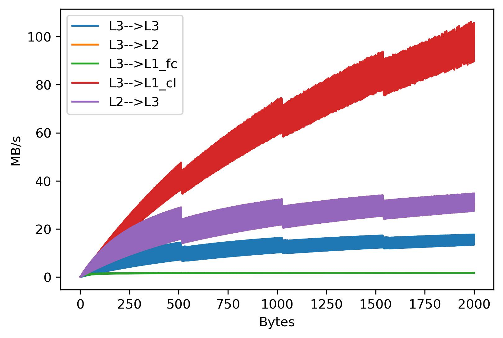

# Transfer_GAP8-_test_Memory
Memory transfer tests between GAP8 memories. L1, L2, L3 (RAM)

You can read more here:
[A BLIS-like matrix multiplication for machine learning in the RISC-V ISA-based GAP8 processor](https://link.springer.com/article/10.1007/s11227-022-04581-6)

If you find it useful you can quote this article : 
´´´
@article{ramirez2022blis,
  title={A BLIS-like matrix multiplication for machine learning in the RISC-V ISA-based GAP8 processor},
  author={Ram{\'\i}rez, Cristian and Castell{\'o}, Adri{\'a}n and Quintana-Orti, Enrique S},
  journal={The Journal of Supercomputing},
  volume={78},
  number={16},
  pages={18051--18060},
  year={2022},
  publisher={Springer}
}
´´´

